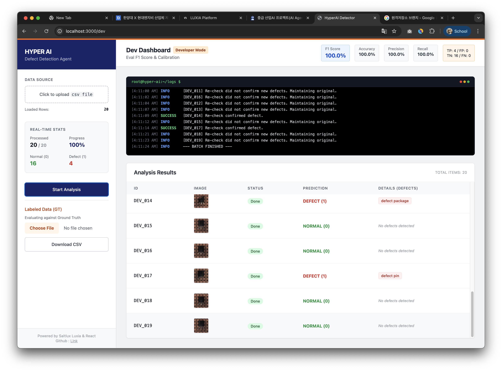
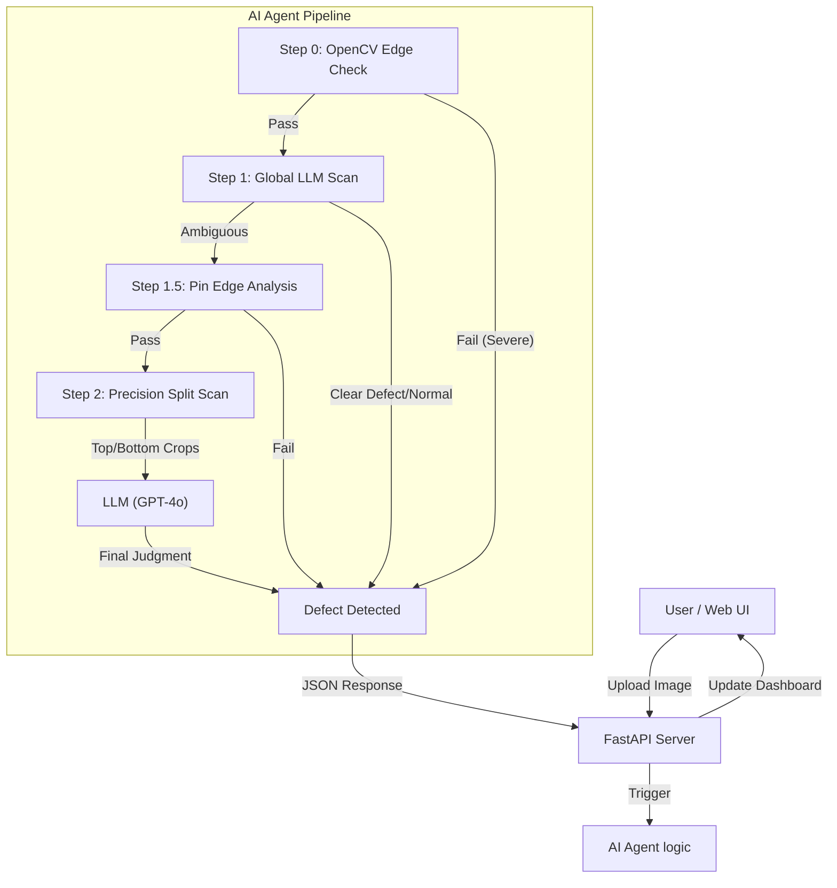

# HyperAI - 반도체 결함 탐지 AI 에이전트 (Semiconductor Defect Detector)

## 📸 WEB UI ScreenShot
<div align="center">

</div>

## 📖 프로젝트 개요
**HyperAI 반도체 결함 탐지기**는 멀티모달(Multi-modal) AI 기술을 활용하여 반도체 제조 공정에서 발생하는 결함을 정밀하게 분석하고 탐지하는 **AI Agent**입니다.

기존의 단순 컴퓨터 비전 기술을 넘어, **LangChain** 프레임워크와 **GPT-4o 기반의 Vision LLM**을 결합하여 이미지의 미세한 구조적 결함뿐만 아니라 문맥적인 결함(핀 휨, 패키지 파손 등)까지 사람처럼 추론하고 판단합니다.

직관적인 **Web UI**를 통해 분석 결과를 실시간으로 모니터링하고, 로그를 통해 AI의 추론 과정을 투명하게 확인할 수 있습니다. 또한, 프롬프트 엔지니어링을 통해 누구나 쉽게 탐지 로직을 수정하고 성능을 지속적으로 개선할 수 있도록 설계되었습니다.

---

## 🚀 주요 기능 (Key Features)

### 1. 멀티모달 AI 기반 결함 분석 (Multi-modal Defect Analysis)
- **Vision + Language:** OpenCV를 이용한 이미지 전처리(Edge Detection, Grid Modeling)와 대형 언어 모델(LLM)의 추론 능력을 결합.
- **Normal vs Defect 비교:** 골든 이미지(정상 제품)와 타겟 이미지를 비교 분석하여 미세한 차이를 감지.

### 2. 단계별 정밀 진단 파이프라인 (3-Step Pipeline)
정확도와 효율성을 모두 잡기 위해 3단계 분석 로직을 수행합니다.
- **Step 0: OpenCV 구조적 이상 감지** (Edge Density Check)
    - 이미지의 엣지 밀도를 분석하여 부품 소실이나 심각한 파손을 1차적으로 빠르게 걸러냅니다.
- **Step 1: Global Scan (전체 맥락 분석)**
    - 전체 이미지를 LLM에게 제공하여 패키지 파손이나 심각한 정렬 불량을 거시적으로 판단합니다.
- **Step 2: Precision Scan (정밀 분할 분석)**
    - **Pin Connectivity Check:** 반도체 핀(Pin)과 홀(Hole)의 연결 상태를 픽셀 단위로 분석.
    - **Vertical Split Strategy:** 이미지를 상단(Body)과 하단(Pins)으로 분할하여 각 영역에 특화된 프롬프트로 정밀 검사를 수행합니다.

### 3. 실시간 모니터링 & 디버깅 Web UI
- **Dashboard:** 분석된 이미지 리스트와 결함 여부(Pass/Fail)를 한눈에 확인.
- **Log Viewer:** AI Agent가 수행한 사고 과정(Chain of Thought)과 LLM 응답 로그를 실시간으로 확인하여 "왜" 결함으로 판단했는지 분석 가능.
- **Dev Mode:** F1 Score, Accuracy, Precision/Recall 등 성능 지표를 실시간으로 계산하여 모델의 신뢰성을 검증.

### 4. 확장 가능한 프롬프트 엔지니어링
- 소스 코드 내의 프롬프트 템플릿(`BASE_CRITERIA` 등)을 수정하여 새로운 결함 유형에 대응하거나 판단 기준을 완화/강화할 수 있습니다.
- Python 코드(`agent.py`) 수정을 통해 탐지 로직을 손쉽게 커스터마이징 가능.

---

## 🛠 기술 스택 (Tech Stack)

### Frontend
- **Framework:** React 19, Vite
- **Language:** TypeScript
- **Styling:** Tailwind CSS (via Utility Classes)
- **Charts/Data:** Custom Tables & Log Viewers

### Backend & AI
- **Server:** Python, FastAPI (API Server)
- **AI Framework:** LangChain (LangChain-OpenAI)
- **Model:** GPT-4o-mini (via Luxia Bridge API)
- **Computer Vision:** OpenCV (cv2), NumPy
- **Environment:** Dotenv for API Key Management

---

## 🧩 시스템 아키텍처 및 로직



---

## 📦 설치 및 실행 방법 (Getting Started)

### Prerequisites
- Node.js (v18+)
- Python (v3.10+)
- Luxia Cloud API Key (or OpenAI API Key compatible endpoint)
- .env 파일 생성 후 해당 hyperai---semiconductor-defect-detector 폴더 내에 API_KEY='당신의 gpt-4o-mini api key' 추가

### 1. Frontend Setup
```bash
# 의존성 설치
npm install

# 개발 서버 실행
npm run dev
```

### 2. Backend Setup
```bash
# Python 의존성 설치 (가상환경 권장)
pip install -r requirements.txt

# 환경 변수 설정 (.env 파일 생성)
# hyperai---semiconductor-defect-detector 폴더 내에 .env 파일 생성
# API_KEY=your_api_key_here

# 서버 실행
python server.py
# 또는
uvicorn server:app --reload
```
### 3. RUN WEB UI
프롬프트나 python 파일이 변경되면 python server.py를 재시작 해야합니다.
npm run dev 와 python server.py는 별도의 터미널에서 동시에 실행중이어야 WEB UI를 실행할 수 있습니다.

### 3-1. AI Agent로 정상/비정상 판별
1. WEB UI(`http://localhost:3000`)에 접속합니다.
2. 분석할 반도체 이미지를 업로드하거나, 테스트용 Data를 로드합니다.
3. 분석 시작 버튼을 누르면 AI Agent가 실시간으로 결함을 탐지합니다.
4. 결과 테이블과 로그 창을 통해 분석 결과를 확인합니다.

### 3-2. 성능개선
1. agent.py 내의 정책(프롬프트와 confidence 조건분기 등)을 수정합니다.
2. 수정 후에는 반드시 npm run dev와 python server.py를 재시작해야 합니다.
3. WEB UI(`http://localhost:3000/dev`)에 접속합니다.
4. 아래에 labeled 데이터를 제공해주면 결과창에서 바로 F1 score, Accuracy, Precision/Recall 등을 확인할 수 있습니다.
5. 성능을 확인해 가며 다시 1번부터 정책을 수정하고 재실행해가며 성능을 개선합니다.

---

## 📝 License
This project is for educational purposes (Industrial AI Agent Hackathon).
